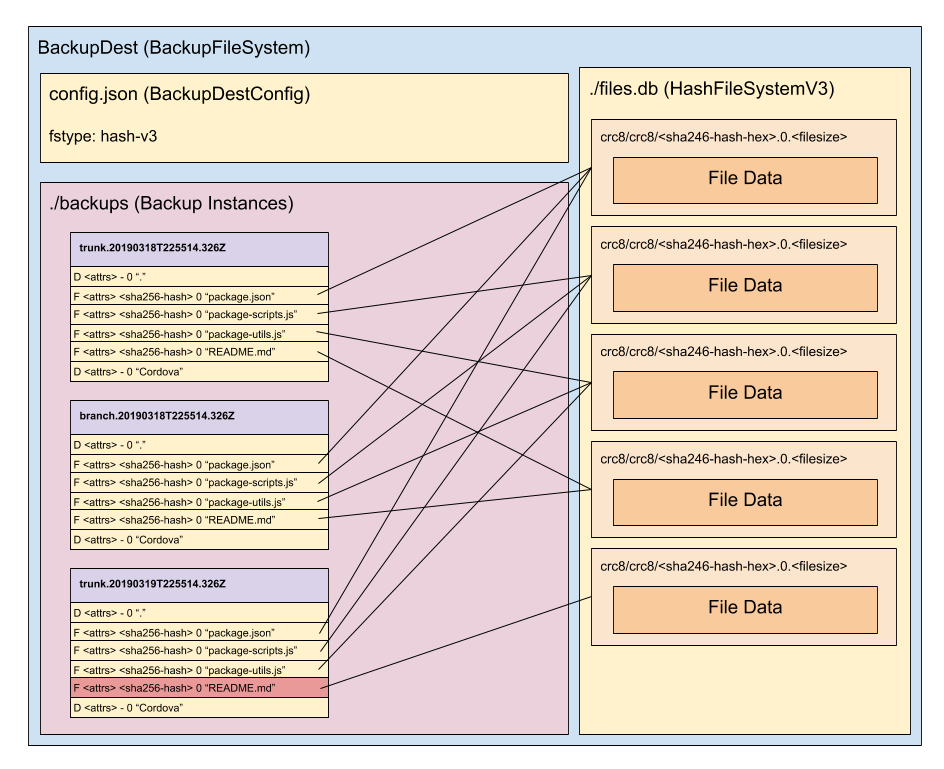

De-Duplicating Backup
==
Experimental (proof-of-concept turned actually used to backup my stuff) hash based backup system.

There are far superior deduplicating backup softwares out there, such as duplicacy, restic and borg (three I am familar with) that all use far superior variable sized chunking deduplication algorithms to do the deduplication and work more efficiently and in a wider range of situations.

But this project isn't about being the best deduplicator, or the most feature rich, or being suitable for every type of backup. It's more of an experiment, a programming excercise and a tool to meet a particular need of mine, to backup source code working environments and document folders.

Install
==
`ddb` requires `node` v10 or later to be already installed.

Installing using npm
--
```
npm i -g dd-backup
```
Note: This will allow ddb to be run using `ddb` rather than `node ddb.js` which may be preferable.

Installing using the install script
--
(requires `git` and either `curl` or `wget`)

At command prompt, cd to the folder where you want to install ddb. For example, `~/bin` or `/usr/local/bin` etc. Then run:

```
curl https://github.com/Mehuge/ddb/raw/master/install.sh | bash
```
or if you prefer to use `wget`
```
wget -qO - https://github.com/Mehuge/ddb/raw/master/install.sh | bash
```

Installing via git
--
```
git clone https://github.com/Mehuge/ddb
cd ddb
```
Run via `node ddb.js ...`

Motivation
===

I noticed that with a lot of our backups there is an awful lot of duplicated data stored in them,
for example, copies of whole source trees, or product installations. Consider also that different
versions (dev, beta, production) of a product often share a large amount of identical files.

Consider then a development machine that has working copies of dev, beta and production, and installed
copies for testing of each, we are talking a lot of duplicate files.

A dumb backup system, backs up each one of these duplicate files, for each instance seen. Granted
incremental backups don't copy those files unless they have changed, but even then if a branch is
updated in several places, each place has a duplicate copy of the updated files.

The Idea
===
What would happen, I thought, if we store the files in a hash based file system? There would only ever
be a single copy of a version of a particular file no matter how many times it appeared in the source
file system.

Proof of concept
--
So I set about coding a proof-of-concept backup system to test out a) if it was feasible, and b) what
kind of space savings could be achieved. Enter ddb, de-duplicating backup.

Hashing
--
I chose sha256 as the hashing algorithm but the issue with a hash is that there are potentially collisions, though highly unlikely it is a possibility, so I had to build in some integrity checks into the system.

sha256 hashs are 64 hexadecimal characters long. These are stored in a folder called `files.db` within the backup destination. The files are stored in buckets implemented as two levels of directories [00-FF]/[00-FF].

The backup store has a version. The current default is hash-v5, though hash-v4 is still supported.

Hash v4
---

Which bucket a hash is placed into is calculated by splitting the hexadecimal hash into two equal length strings, and calculating the crc8 hash of each, these become the folder names for the bucket. 
To handle potential hash clashes (two actually different files, with the same hash), by default the
backup compares a hit in the hash file system byte-by-byte with the source file, and if they are different, will store the file as a variant. These variant numbers are appended to the hash as .0 .1 .2 etc. I have yet to see this happen. 

There is a `--fast` option which skips this additional integrity, and the soon to come client/server version will by default use `--fast`.

In the Future: The `--fast` option will be phased out. I have yet to see a clash, and don't think the byte-by-byte compare is worth it. Perhaps adding a `--slow` option instead.

Hash v5
---

Which bucket a hash is placed into is determined by the first 4 hex digits from the hash, so aa348c4d... becomes aa/34/8c4d...  This has the advantage a human can quickly determine which bucket a file will be in.

The --fast option has no effect in hash-v5, there is no attempt to handle two different files with the same hash, because the odds of it ever happening are miniscule.

Backup Targets
--
Backups target a destination which is either an non-existant or empty folder, or an existing
backup destination, or a backup server over http or https. If the folder does not exist, or is empty it will be created and/or initialised.

The backup filesystem is stored in a `files.db` subfolder, and backup sets (and their increments) are
stored in the `backups` subfolder.  There is a `config.json` which contains the fs-type of the
backup destination.

Backup destinations (`--to` or `--dest`) are designed to be shared. The more it is shared, the more de-duplication occurs. It is possible to have a separate backup destination for each backup, and that will de-duplicate files within that backup, but the destination can also be shared by multiple backup sets.

Backup Set
--
A backup set (`--set-name`) is a named backup placed in a backup destination. It has increments and a current marker. The default backup set if not specified is named default. A backup set can specify one or more backup sources (--from).

Backup Source
--
A backup source (--from) is a root path, optionally sub-folders to backup and/or include and exclude patterns for filtering and tells the backup which files to back up.

Incremental backups
--
The concept of full, differential or incremental backups doesn't make sense in this type of backup system. Every backup is incremental, the first backup just happens to take longer because it potentially has to backup everything.

Managing increments
==
Because of the nature of the backup format, the hash based file system that is used to store files, managing increments is really simple, for instance to remove the first backup, just delete its index, don't need to merge it with the next increment. Once an increment or increments have been removed, then run a `clean` on the filesystem which will check all the hashs still in use by increments, and remove ones that are no longer referenced. This can be done separately from the removal of the increment.

**File System**

The filesystem is implemented in the `BackupFileSystem` class. The filesystem has an fstype, which is currently one of `hash-v3` or `hash-v4` which are implemented in turn by `HashFileSystemV3` and `HashFileSystemV4`.

*Note: v4 is the default filesystem, v3 must be specified when creating a destination using the `--fstype=hash-v3` option.

`hash-v3` is uses a simple crc8/crc8 bucket system which limits the `files.db` and child-folders to 256 entries max, with the hashed files stored as a leaf node. The folders containing the leaf nodes will grow but testing suggests the growth is fairly evenly spread across the buckets, so growth is slow. This means that the system could store 16 million files and only have around 256 hashed files per bucket. It also means that the file system will use at most 65,536 folders regardless of the numbers of files, solving the main problem with `hash-v1` whilst also being faster (less folders to manage). Because the bucket is chosen using a hash of the file hash, there is no need to maintain an index of the hashes, so does not suffer from the problems with `hash-v2` of being slow, and risks to integrity.



`hash-v4` is `hash-v3` with compression. I suppose I could have called it `hash-v3-compressed`! As files are stored in the file system gzipped (zlib). As files are copied out of or hashed they are decompressed using gunzip (zlib). This compression is handled inline using streams, so adds very little overhead in terms of performance.

`hash-v5` changes the bucket system to use the more simple, and human readable, first 2 / 2 characters from the hash as the bucket folder names, so for example in v4 we might have `a7/24/aabbccddeeff...` in v5 that becomes `aa/bb/ccddeeff...`. It then becomes easy to take a hash from one of the backup lists and map it to a files.db path by simply adding two / characters, making it easy to manually extract files from the backup.

**Todo:**

- [x] filesystem cleanup (remove files in the file system no longer referenced by any increment)
- [x] add a restore option (would be kind of useful)
- [x] use compression (store indexes and blobs as .gz files)
- [x] include and exclude files/paths
- [ ] --exclude-file list excludes in a file (like .gitignore)
- [ ] --remove-older remove backup instances older than a specified age
- [x] `ddb list` list backups
- [x] add ability to select an increment to list / verify / support
- [ ] add support for backup configs `node ddb.js --config <path-to-config>`
- [ ] add reporting options (email, status file ...)
- [x] networking: add ability to backup over the network - --server mode
- [x] networking: add restore support over network
- [ ] networking: add run backup server over ssh (a one time backup server)
- [x] networking: add --http and --https options for server mode, default to https if port ends in 443 (443, 4443, 44443)
- [ ] networking: skip restoring files if local copy hash is the same as the servers hash.
- [x] a better file system
- [x] a simpler file system (use first characters of hash for bucket names) (backup-filesystem-v5)
- [ ] encryption (backup-filesystem-v6)
- [x] authentication: backup server should be able to authenticate clients
- [ ] authentication: allow access-key to be specified via the environment
- [ ] --move-set move a backup set from one backup destination to another.
- [ ] --archive archive a backup destination
- [ ] `ddb cp` command, copy files matching wildcard from a backup instance
- [ ] `ddb cat` like cp but to standard output.
- [ ] `ddb search` search for a file matching pattern
- [ ] Make `--fast` the default for local backups. Add `--no-fast` to disable.
- [ ] Add option to remove a file from a backup set (and all its instances) `ddb rm`


Usage
==

See [MANUAL.md](MANUAL.md) for full usage documentation and examples.
