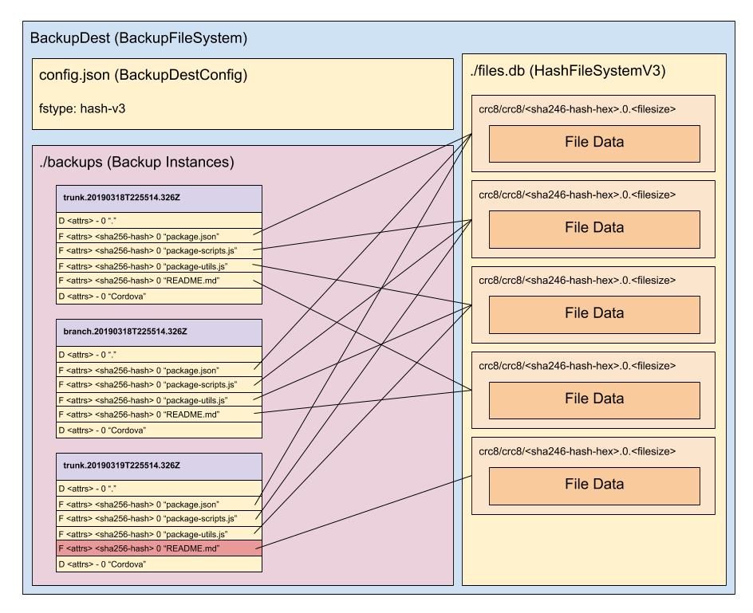

De-Duplicating Backup
==
Experimental (proof-of-concept) hash based backup system.

Motivation
===

I noticed that with a lot of our backups there is an aweful lot of duplicated data stored in them,
for example, copies of whole source trees, or product installations. Consider also that different
versions (dev, beta, production) of a product often share a large amount of identical files.

Consider then a development machine that has working copies of dev, beta and production, and installed
copies for testing of each, we are talking a lot of duplicate files.

A dumb backup system, backs up each one of these duplicate files, for each instance seen. Granted
incremental backups don't copy those files unless they have changed, but even then if a branch is
updated in several places, each place has a duplicate copy of the updated files.

The Idea
===
What would happen, I thought, if we store the files in a hash based file system? There would only ever
be a single copy of a version of a particular file no matter how many times it appeared in the source
file system.

Proof of concept
--
So I set about coding a proof-of-concept backup system to test out a) if it was feasable, and b) what
kind of space savings could be achieved. Enter ddb, de-duplicating backup.

Hashing
--
I chose sha256 as the hashing algorithm but the issue with a hash is that there are potentially collisions, though highly unlikely it is a possibility, so I had to build in some integrity checks into the system.

sha256 hashs are 64 hexadecimal characters long. These are stored in a folder called `files.db` within the backup destination. The files are stored in buckets implemented as two levels of directories [00-FF]/[00-FF]. Which bucket a hash is placed into is calculated by splitting the hexdecimal hash into two equal length strings, and calculating the crc8 hash of each, these become the folder names for the bucket.

To handle potential hash clashes (two actually different files, with the same hash), by default the
backup compares a hit in the hash file system byte-by-byte with the source file, and if they are different, will store the file as a variant. These variant numbers are appended to the hash as .0 .1 .2 etc. I have yet to see this happen.

There is a --fast option which skips this aditional integrity, and the soon to come client/server version will by default use --fast.

Backup Targets
--
Backups target a destination which is either an non-existant or empty folder, or an existing
backup destination, or a backup server over http. If the folder does not exist, or is empty it will be created and/or initialised.

The backup filesystem is stored in files.db sub-folder, and backup sets (and their increments) are
stored in the `backups` subfolder.  There is a config.json which contains the fs-type of the
backup destination.

Backup destinations (`--to` or `--dest`) are designed to be shared. The more it is shared, the more de-duplication occurs. It is possible to have a separate backup destination for each backup, and that will de-duplicate files within that backup, but the destination can also be shared by multiple backup sets.

Backup Set
--
A backup set (`--set-name`) is a named backup placed in a backup destination. It has increments and a current marker. The default backup set if not specified is named default. A backup set can specify one or more backup sources (--from).

Backup Source
--
A backup source (--from) is a root path, optionally sub-folders to backup and/or include and exclude patterns for filtering and tells the backup which files to back up.

Incremental backups
--
The concept of full, differential or incremental backups doesn't make sense in this backup system. Every backup is incremental, the first backup just happens to be the largest increment.

Managing increments
==
Because of the nature of the backup format, the hash based file system that is used to store files, managing increments is really simple, for instance to remove the first backup, just delete its index, don't need to merge it with the next increment. Once an increment or increments have been removed, then run a cleanup on the filesystem which will check all the hashs still in use by increments, and remove ones that are no longer referenced. This can be done separately from the removal of the increment.

TODO: Add a --remove-older option to clean up old increments

**File System**

The filesystem is implemented in the `BackupFileSystem` class. The filesystem has an fstype, which is currently one of `hash-v3` or `hash-v4` which are implemented in turn by `HashFileSystemV3` and `HashFileSystemV4`.

*Note: v3 is the default filesystem, v4 must be specified when creating a destination using the `--fstype=hash-v4` option.

`hash-v3` is uses a simple crc8/crc8 bucket system which limits the `files.db` and child-folders to 256 entries max, with the hashed files stored as a leaf node. The folders containing the leaf nodes will grow but testing suggests the growth is fairly evenly spread across the buckets, so growth is slow. This means that the system could store 16 million files and only have around 256 hashed files per bucket. It also means that the file system will use at most 65,536 folders regardless of the numbers of files, solving the main problem with `hash-v1` whilst also being faster (less folders to manage). Because the bucket is chosen using a hash of the file hash, there is no need to maintain an index of the hashes, so does not suffer from the problems with `hash-v2` of being slow, and risks to integrity.



`hash-v4` is `hash-v3` with compression. I suppose I could have called it `hash-v3-compressed`! As files are stored in the file system gzipped (zlib). As files are copied out of or hashed they are decompressed using gunzip (zlib). This compression is handled inline using streams, so adds very little overhead in terms of performance.

**Todo:**

- [x] filesystem cleanup (remove files in the file system no longer referenced by any increment)
- [x] add a restore option (would be kind of useful)
- [x] use compression (store indexes and blobs as .gz files)
- [x] include and exclude files/paths
- [ ] --exclude-file list excludes in a file (like .gitignore)
- [ ] --remove-older remove backup instances older than a specified age
- [x] `ddb list` list backups
- [x] add ability to select an increment to list / verify / support
- [ ] add support for backup configs `node backup.js --config <path-to-config>`
- [ ] add reporting options (email, status file ...)
- [x] networking: add ability to backup over the network - --server mode
- [x] networking: add restore support over network
- [ ] networking: add run backup server over ssh (a one time backup server)
- [ ] networking: add --http and --https options for server mode, default to https if port ends in 443 (443, 4443, 44443)
- [ ] networking: skip restoring files if local copy hash is the same as the servers hash.
- [x] a better file system
- [ ] encryption (backup-filesystem-v5)
- [ ] authentication: backup server should be able to authenticate clients
- [ ] --move-set move a backup set from one backup destination to another.
- [ ] --archive archive a backup destination
- [ ] --(un)compress (convert hash-v3 to hash-v4 and visa versa)
- [ ] `ddb cp` command, copy files matching wildcard from a backup instance
- [ ] `ddb cat` like cp but to standard output.
- [ ] `ddb search` search for a file matching pattern

TODO: Authentication
--
Only makes sense for the backup client/server mode. Allow a passwd file to be created in the
backup destination that allows backup client keys to be defined, optionally tied to an IP.  Only clients that can authenticate with a key can use the backup server.

TODO: Encryption
--
Implement this as hash-v5 which is compressed+encrypted. This would work by providing a key at runtime (via environment, option or prompt) that hash-v5 will use to encrypt/decrypt the files.

The last stage will be encryption, that is the files will be compressed before encrypted and decrypted before decompressed. This is because in client-server mode the client does the compression, so files being stored in the file system are already compressed.

*Local backup:*<br>
disk -> compress -> encrypted -> disk

*Remote backup:*<br>
disk -> compress -> network (https) -> encrypt -> disk

Limitations
==
Does not nor any plans to support:
- windows permissions
- unix extended permissions
- not suited to backing up large, changing files
- does not store differences between versions of a file, but whole copies

Usage Examples
==

Backup
--
```
node ddb.js backup L:\BACKUPS\DDB --fast --set-name ddb --from . --exclude node_modules --exclude .git --include .gitignore --verify --verbose
```
Backs up the current directory (`--from .`) to `L:\BACKUPS\DDB` using the fast option (relies on hashes being unique) a backup set named `ddb` that includes all files except those beginning `node_modules` and `.git`.

Verify the contents of a backup
--
```
node ddb.js verify L:\BACKUPS\DDB --set-name ddb --verbose
```
Verify the `ddb` backup verbosely (same as specifying `--verify` during the backup).

Verify and compare
--
```
node backup.js --to L:\BACKUPS\DDB --set-name ddb --verify-and-compare --verbose
```
Like verify excpet that the backup files for the current instance are compared (byte-for-byte) with the originals.

List backups
--
```
node ddb.js list L:\BACKUPS\DDB --set-name ddb
```
List all the instances for a backup set. Returns the timestamp, file count, size and time taken to run the backup.

```
node ddb.js list L:\BACKUPS\DDB --set-name ddb --when 2019-03-22T20:59:52.958Z
```
Lists the contents of a backup instance. The `--when` option takes the instance time as an ISO format string, or can specify current to mean the last available instance.

```
node ddb.js list L:\BACKUPS\DDB --set-name ddb --when 2019-03-22T20:59:52.958Z --sources
```
Lists the backup sources (the from directories) in a backup. This is useful if the backup set contains multiple sources, and may be required to specify which source when performing a restore.

Restore
--
```
node ddb.js restore K:/BACKUPS/DDB --set-name ddb --output=D:\TEMP\RESTORE --verbose
```
Restore the last (current) backup for backup set `ddb` and restore it to `D:\TEMP\RESTORE`.

```
node ddb.js restore K:/BACKUPS/DDB --set-name ddb --output=D:\TEMP\RESTORE --exclude ** --include lib --verbose
```
Restore the `lib` sub-folder of the last (current) backup for backup set `ddb` and restore it to `D:\TEMP\RESTORE`.

```
node ddb.js restore http://backupserver:4444/ --set-name ddb --output=D:\TEMP\RESTORE --exclude ** --include lib --verbose
```
Restore the `lib` sub-folder of the last (current) backup for backup set `ddb` from a backup server running on backupserver listening on port 4444 and restore it to `D:\TEMP\RESTORE`.

Run backup as a server
--
```
node ddb.js server K:/BACKUPS/SERVER --verbose
```

Backup servers are hard coded to create a hash-v4 (compressed) file system, and automatically enable --fast mode.

`hash-v4` is used because files are transfered to the server already gzipped to save network bandwidth so it make little sense to decompress them just to put them in a hash-v3 file system, instead they are copied right from the http stream into the file system as-is, so the server doesn't do any compression, the compression is all done by the client.

Fast mode is used because comparing files accross the network would be too expensive, so backups rely on the hashes for comparisons. When considering a file to backup the client hashes the file, then asks the server if it has that hash, if it does, the client just says log this file as backed up. If not, it compresses the file and sends it to the server.  Only changed files are ever transmitted over the network.

Future: An optimisation here may be to do some kind of rdiff of the file, once we know we need to send the file, if the server can find a previous version of the file from the previous backup set log, it could produce a hash chain for that version (hashes for each block) and send the hash chain to the client, the client could then work out which parts of the file it needs to send to the server so it can construct the new version of the file from the previous version. This would be great for backing up log files, as only the new parts of the log files would be sent.

